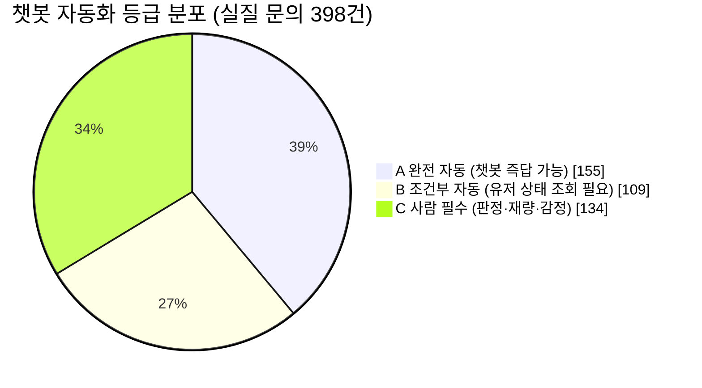
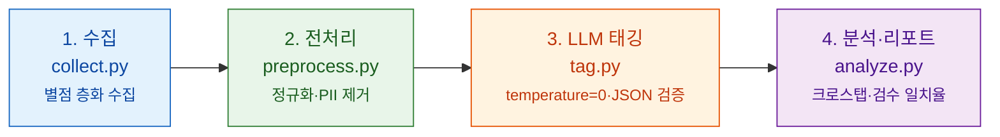

# SNOW·B612 앱 리뷰 VOC 분석 — CS 문의 유형 & 챗봇 자동화 가능성 추정

> 카메라·AI 앱 **SNOW·B612**의 구글플레이 리뷰 약 500건을 **① 문의 유형**과 **② 챗봇 자동화 가능 등급**으로 분류·집계한 1회성 VOC 분석입니다.
> *"CS 문의가 어떤 유형에 몰리는가"* 와 *"그중 챗봇으로 자동 응대할 수 있는 비율은 얼마인가"* 를 추정합니다.

**이 프로젝트는 무엇을 위한 것인가.** SNOW **"AI CS 기획/운영 인턴"**(Service & Business > Product Development) 지원용 포트폴리오입니다. 이 자리는 CS 상담원이 아니라 **AI 상품 결제 클레임을 챗봇으로 흡수하고, CS 로그를 프로덕트 개선 신호로 환류시키는** 프로덕트 조직의 역할입니다. 그래서 직무의 실제 요구는 **① 문의 분류 체계(taxonomy) 설계**와 **② AI 챗봇 답변 품질 관리**이고, 회사 내부 CS 데이터에 접근할 수 없다는 제약 아래 **공개 VOC(앱 스토어 리뷰)를 CS 문의의 대리 지표로 삼아** 그 역량을 미리 증명합니다.

> **왜 지금 이 문제인가.** 무료 앱 시절엔 결과물이 불만이면 유저가 **앱을 지웠지만**, 건당 결제(4,500~9,900원)·구독으로 수익 모델이 바뀐 지금은 **환불을 요구**합니다. 게다가 AI 생성물 불만("얼굴이 안 닮았다")은 불량이 아니라 취향이라 판정도 어렵습니다. **문의량과 판정 난이도가 동시에 올랐고, 이걸 사람 수로 감당하면 마진이 사라집니다 — 그래서 챗봇 자동화가 과제가 됩니다.**

---

## 📌 한눈에 보기 (TL;DR)

| 항목 | 내용 |
|---|---|
| **무엇을** | SNOW·B612 구글플레이 한국어 리뷰 495건(태깅 완료)을 2축 체계로 분류·집계 |
| **핵심 질문** | ① 문의가 어떤 유형에 몰리나? ② 챗봇으로 자동 응대 가능한 비율은? |
| **핵심 결과** | 최다 유형 **촬영·기능 사용 35.4%**, 챗봇 **완전 자동(A) 후보 38.8%**(백엔드 연동 B까지 66.0%) |
| **가장 중요한 발견** | **유형 분류는 신뢰할 만하지만(일치율 82%), 챗봇 등급 판정은 아직 사람 검토가 필요(47.6%)** |
| **핵심 설계** | 유형(What) × 챗봇등급(So what) **2축 분리** + 앱 개선 신호(product_issue) 플래그 |
| **성격** | 6시간 MVP · 재현 가능한 데이터 파이프라인 (수집→전처리→태깅→분석) |

> **표본** 495건(판단 보류 5건 제외) · **기간** 2021-11 ~ 2026-09 · **채널** 구글플레이 한국어 · **앱** SNOW 250건 / B612 250건

**한 줄 스토리.** *"공개 앱 리뷰를 CS 문의의 대리 지표로 삼아 500건을 2축 체계로 태깅하고, 그 결과를 독립 검수로 검증했습니다. 핵심은 **AI로 운영 리소스를 줄이되, 그 한계까지 데이터로 짚었다**는 것 — 유형 분류는 자동화해도 되지만 챗봇 자동화 등급 판정은 아직 사람이 봐야 한다는 것을 정량적으로 보였습니다."*

---

## 🧭 분류 체계 — 이 프로젝트의 지적 핵심

모든 숫자는 아래 **두 개의 축 + 한 개의 플래그**로 매겨졌습니다. 분류 체계는 코드에 하드코딩하지 않고 [`taxonomy.json`](taxonomy.json)에서 읽어 들입니다.

### ① 유형 (What) — "무엇에 대한 문의인가"

| 코드 | 유형 | 대표 예시 |
|---:|---|---|
| 1 | 설치·계정 | 실행 불가 · 기기 호환 · 로그인/계정 연동 · 데이터 이전 |
| 2 | 촬영·기능 사용 | 기능 못 찾음 · 필터/카메라 동작 이상 · 기대와 다른 결과물 |
| 3 | AI 생성 | 생성 실패·무한대기 · 결과물 품질 불만(취향) · 왜곡 결과물 · 재생성 과금 |
| 4 | 저장·공유 | 화질 저하 · 저장 실패 · 워터마크 |
| 5 | 결제·구독 | 결제 실패 · 중복 결제 · 환불 요구 · 구독 해지 · 자동갱신 미인지 |
| 6 | 광고 | 노출 빈도·타이밍 · 광고 제거 조건 |
| 7 | 정책·개인정보 | 사진 데이터 처리 · 계정 삭제 · 연령 제한 |
| 0 | 분석 제외 | 단순 칭찬·비난 · 내용 없음 (집계에서 제외) |

### ② 챗봇 자동화 등급 (So what) — "챗봇이 얼마나 스스로 답하나"

| 등급 | 이름 | 정의 |
|:---:|---|---|
| **A** | 완전 자동 | 정답이 고정. **유저 상태를 몰라도** 답변 가능 (FAQ성) |
| **B** | 조건부 자동 | **유저 상태 조회**(어드민·결제내역 연동)가 필요 |
| **C** | 사람 필수 | 판정·재량·감정이 개입 (예: 환불 여부, 취향 불만) |

**➕ 플래그 `product_issue` (Y/N)** — 챗봇으로 막을 게 아니라 **앱 자체를 고쳐야 하는** 이슈인지 표시.

### 왜 이렇게 설계했나 (설계 결정 = 이 프로젝트의 진짜 가치)

- **유형(What)과 등급(So what)을 별도 축으로 분리했다.** 한 축(유형)만 보면 *"결제 문의가 많다"* 까지가 끝이지만, 등급 축을 더해야 *"그중 어디까지 챗봇이 되나"* 라는 **실행 가능한 결론**이 나옵니다. 같은 유형이라도 챗봇 난이도는 A~C로 갈리기 때문입니다.
- **앱 축이 아니라 유저 행동 단계(설치→촬영→저장→결제) 축으로 나눴다.** 앱이 여러 개라도 유저가 겪는 단계는 겹칩니다. 앱 축으로 쪼개면 표본만 조각나 패턴이 안 보이므로, **앱은 축이 아니라 속성 컬럼**으로 붙였습니다.
- **다중 태깅을 금지하고 주 유형 1 + 부 유형 1(선택)로 강제했다.** 다중 태깅은 비율 합이 100%를 넘겨 리포트 해석이 불가능해집니다. 복합 문의는 부 유형으로 흡수해 **합을 100%로 유지**했습니다.
- **0번(무내용)을 억지로 분류하지 않았다.** 0번 비율(19.2%) 자체가 *"표본에서 실질 문의가 얼마나 되는가"* 를 보여주는 지표입니다.

> 분류 체계는 정답이 아니라 **user journey에서 도출한 가설(v0)** 입니다. 검수에서 검증·수정되어 v1이 되는 것이 정상이며 — **그 재설계 과정 자체가 산출물**입니다. (근거: [`docs/USER_JOURNEY.md`](docs/USER_JOURNEY.md), [`docs/ADR.md`](docs/ADR.md))

---

## 📊 핵심 결과

### 결과 1 — 문의는 어떤 유형에 몰리나

내용 있는 실질 문의 중 **촬영·기능 사용(필터·카메라가 원하는 대로 안 됨)** 이 압도적으로 많고, **결제·구독**이 뒤를 잇습니다. (전체의 19.2%는 별점만 남긴 칭찬·비난이라 분석에서 제외)

| 코드 | 유형 | 건수 | 비율 | 분포 (전체 495건 기준) |
|---:|---|---:|---:|---|
| 2 | 촬영·기능 사용 | 175 | **35.4%** | `████████████████████` |
| 5 | 결제·구독 | 111 | **22.4%** | `█████████████` |
| 0 | 분석 제외 | 95 | 19.2% | `███████████` |
| 6 | 광고 | 44 | 8.9% | `█████` |
| 1 | 설치·계정 | 26 | 5.3% | `███` |
| 4 | 저장·공유 | 24 | 4.8% | `███` |
| 3 | AI 생성 | 18 | 3.6% | `██` |
| 7 | 정책·개인정보 | 2 | 0.4% | `▏` |

### 결과 2 — 챗봇으로 얼마나 답할 수 있나 (이 프로젝트의 핵심 질문)

실질 문의(유형 1~7, 398건 집계 대상) 중 **정답이 고정된 완전 자동(A) 후보가 38.8%**, 여기에 백엔드 조회가 필요한 조건부 자동(B)까지 더하면 **66.0%**입니다.



> ⚠️ **중요 — 이 비율은 자동화 '가능성 추정치'이지, 실제 문의가 그만큼 줄어든다는 뜻이 아닙니다.** 내부 티켓 데이터 없이는 실제 인입 감소율을 산출할 수 없습니다. (한계 3 참조)

### 결과 3 — 유형 × 챗봇등급 크로스탭 (리포트의 심장)

각 유형의 문의가 자동화 난이도별로 어떻게 갈리는지 보여줍니다. **행 = 문의 유형, 열 = 챗봇 자동화 등급.** (유형 0·판단 보류분 제외)

| 유형 | A 완전자동 | B 조건부 | C 사람필수 | 합계 |
|---|---:|---:|---:|---:|
| 2 촬영·기능 사용 | **79** | 23 | 72 | 174 |
| 5 결제·구독 | 18 | **64** | 29 | 111 |
| 6 광고 | 31 | 1 | 12 | 44 |
| 1 설치·계정 | 18 | 4 | 4 | 26 |
| 4 저장·공유 | 3 | 13 | 7 | 23 |
| 3 AI 생성 | 5 | 4 | 9 | 18 |
| 7 정책·개인정보 | 1 | 0 | 1 | 2 |
| **합계** | **155** | **109** | **134** | **398** |

**챗봇 자동화 1순위 후보** — 정답이 고정된 A등급이 많이 몰린 유형일수록 도입 효과가 큽니다:

| 유형 | A 건수 | 유형 내 A 비중 |
|---|---:|---:|
| 6 광고 | 31 | **70.5%** |
| 1 설치·계정 | 18 | **69.2%** |
| 2 촬영·기능 사용 | 79 | 45.4% (건수 최다) |
| 5 결제·구독 | 18 | 16.2% |

### 결과 4 — 앱마다 문의 유형이 다르다 (SNOW vs B612)

자매 앱이지만 많이 들어오는 문의 유형이 서로 달랐습니다. **Δ = SNOW % − B612 %** (양수면 SNOW에 더 많음):

| 유형 | Δ (SNOW − B612) | 어느 앱에 더 많나 | |
|---|---:|---|---|
| 설치·계정 | **+5.7p** | 🔵 SNOW | `███████` |
| 결제·구독 | +3.7p | 🔵 SNOW | `████` |
| AI 생성 | +3.3p | 🔵 SNOW | `███` |
| 촬영·기능 사용 | −0.3p | ≈ 거의 동일 | `▏` |
| 광고 | −4.8p | 🟢 B612 | `█████` |
| 저장·공유 | −4.9p | 🟢 B612 | `█████` |

> **AI 아바타·결제 성격의 SNOW** vs **일상 카메라·편집 성격의 B612** 차이가 데이터로 드러납니다.

### 결과 5 — 앱을 고쳐야 하는 신호 (product_issue = Y)

챗봇으로 막을 게 아니라 **앱 자체를 고쳐야 하는** 이슈로 태깅된 건이 **254건**(태깅의 51.3%)입니다. 상위 유형: 촬영·기능(155) · 결제·구독(29) · 설치·계정(24) · 저장·공유(21). → JD의 *"앱 기능 관련 이슈 리포트 보조"* 에 대응하는, CS 로그를 프로덕트 신호로 환류시키는 지점입니다.

---

## 🔍 검수 — 신뢰도를 정량화하다 (가장 중요한 파트)

LLM 태깅을 그대로 믿지 않고, **무작위 50건을 분류 체계로 독립 태깅**해 일치율을 측정했습니다. (LLM 태그를 보지 않고 매기는 **독립성 원칙**을 지켰습니다 — 보고 매기면 일치율이 부풀려집니다.)

| 축 | 일치율 | 시각화 | Cohen's κ | 판정 |
|---|---:|---|---:|---|
| **유형 (What)** | 82.0% | `████████░░` | 0.765 | ✅ 우연 보정 후에도 신뢰할 만함 |
| **챗봇 등급 (So what)** | 47.6% | `█████░░░░░` | 0.244 | ⚠️ **사람 검토가 필요 = 신뢰도의 약한 고리** |

> **이 프로젝트가 발견한 가장 중요한 사실:** 유형 분류는 자동화해도 되지만, **챗봇 자동화 등급 판정(A/B/C)은 아직 사람이 봐야 합니다.** 이것이 *"AI로 CS를 자동화하되 그 한계까지 안다"* 는 직무 시그널입니다.
>
> 불일치는 무작위가 아니라 **경계 유형**(취향 불만 vs 품질 불량, AI생성 ↔ 결제 복합)에 몰립니다. 이는 LLM 성능 문제가 아니라 **분류 체계 자체의 문제** → v1 재설계 근거가 됩니다.
>
> **정직한 표기:** 이번 회차 검수는 진짜 사람이 아니라 **2차 LLM 독립 교차검증**이었음을 명시합니다. (진짜 human audit 절차는 [`docs/HUMAN_AUDIT.md`](docs/HUMAN_AUDIT.md)에 준비돼 있습니다.)

---

## ⚠️ 한계 (먼저 밝히는 방어선)

1. **리뷰는 CS 문의의 대리 지표(proxy)다.** 결제·환불처럼 고객센터로 직행하는 문의는 리뷰에 덜 남아 과소 추정될 수 있다.
2. **한국어·구글플레이·2개 앱에 편중**됐다. App Store와 해외(약 40% 시장)의 유형 분포는 검증하지 못했다.
3. **A등급 비율은 자동화 '가능성 추정치'이지 실제 문의 인입 감소율이 아니다.** 내부 티켓 데이터 없이는 감소율을 산출할 수 없다.
4. **LLM 1차 태깅의 불일치는 경계 유형에 집중**된다 — 곧 분류 체계를 v1로 고쳐야 할 지점이다.

**방법론적 전제:** 리뷰 = 대리 지표, 자동화 비율 = 추정치, 분류 체계 = 검증 대상 가설. 이 세 가지를 먼저 밝히고 시작합니다.

---

## 🚀 다음 단계 (했다면 / 물으면)

- **분류 체계 v1 재설계** — 검수 불일치가 몰린 경계(취향 불만 vs 품질 불량, AI생성 ↔ 결제)를 분리·재정의.
- **진짜 human audit** — 2차 LLM이 아닌 사람 검수로 챗봇 등급 축의 신뢰도를 재측정.
- **A등급 상위 유형부터 챗봇 FAQ 후보로 분리** — 정답이 고정된 광고·설치·계정 유형이 자동화 착수 1순위.
- **스코프 확장** — App Store·다국어(해외 약 40% 시장)로 유형 분포 검증.

---

## 🧩 이 프로젝트가 증명하는 역량 (JD 대비)

| JD가 실제로 요구하는 것 | 이 프로젝트가 보인 것 |
|---|---|
| **문의 분류 체계 설계** (JD: "정보를 구조화하고 데이터를 관리") | user journey 기반 2축+플래그 체계를 가설(v0)로 세우고, 실측으로 검증·재설계하는 루프를 설계 |
| **AI 답변 품질 관리** (JD: "AI CS 답변 퀄리티 관리") | LLM 자동 태깅 + 독립 검수로 신뢰도를 **정량화**(유형 82% / 등급 47.6%), 약한 고리를 명시 |
| **문의 지표 정의·분석** (JD: "일간/주간 문의 지표 보고") | 총량이 아니라 유형·앱·자동화 등급 축으로 분해해 크로스탭·앱 간 차이를 도출 |
| **자기 주도적 역제안** (JD: "자기 주도적 업무 진행") | "이 유형은 챗봇으로, 이건 앱을 고쳐야" 를 데이터로 구분(product_issue 254건) |
| **판단의 정직성** | "검수는 진짜 human이 아닌 2차 LLM", "자동화 비율은 추정치" 등 한계를 먼저 밝힘 |

---

<details>
<summary><b>🛠️ 부록 — 어떻게 만들었나 (파이프라인·실행·데이터 원칙)</b></summary>

<br>

분석 결과의 재현성을 담보하기 위한 기술 구성입니다. 이 프로젝트의 **가치는 분류 체계 설계와 검수에 있고, 아래는 그 결과를 만들어낸 도구**입니다.

**파이프라인** — 웹앱이 아니라 단계별 독립 스크립트로, 파일(JSON/CSV)로 데이터를 넘깁니다. 한 스크립트는 한 단계만 담당합니다.



| 단계 | 스크립트 | 핵심 포인트 |
|---|---|---|
| 1. 수집 | [`src/collect.py`](src/collect.py) | 별점 층화 수집(1점 40%/2~3점 40%/4~5점 20%), 원본 분포 별도 기록 |
| 2. 전처리 | [`src/preprocess.py`](src/preprocess.py) | 스키마 정규화, 중복·빈 리뷰 제거, **PII(작성자명) 드롭** |
| 3. 태깅 | [`src/tag.py`](src/tag.py) | taxonomy 기준 배치 태깅(15건/콜), `temperature=0`, JSON 강제 파싱 + 범위 검증, 실패는 검수큐로 |
| 4. 분석 | [`src/analyze.py`](src/analyze.py) | 유형×등급 크로스탭, 앱별 차이, 자동화 비율, Cohen's κ 검수 일치율 |

**기술 스택:** Python 3.11 · pandas · google-play-scraper · Anthropic Claude(temperature=0) · openpyxl/Markdown 출력

**실행 방법**
```bash
python -m venv .venv && source .venv/bin/activate
pip install -r requirements.txt
cp .env.example .env        # ANTHROPIC_API_KEY 입력
python src/collect.py       # 1. 수집   → data/raw/
python src/preprocess.py    # 2. 전처리 → data/processed/sample.csv
python src/tag.py           # 3. 태깅   → data/processed/tagged.csv
python src/analyze.py       # 4. 분석   → docs/report.md (+ report.xlsx)
```

**데이터·보안·윤리 원칙** — 공개 리포지토리라 유출은 되돌릴 수 없다는 전제 위에서 세 가지 선을 지켰습니다. ① 비밀키·원본 데이터를 커밋하지 않음(`.env`·`data/`는 `.gitignore`, 공개하는 건 집계 결과와 코드뿐), ② **리뷰 원문을 재배포하지 않음**(집계·분류 명칭만), ③ 작성자명 등 PII는 전처리에서 드롭. (스크래핑은 스토어 약관상 회색지대이므로 소규모·저빈도로 수집하고 원문은 공개하지 않았습니다.)

**리포지토리 지도**
```
snow-ai-cs/
├── README.md            ← 이 문서 (프로젝트 진입점)
├── PORTFOLIO.md         종합 브리핑 (더 깊은 설명)
├── taxonomy.json        분류 체계 정의 (2축 + 플래그) — 코드가 읽음
├── src/                 config · collect · preprocess · tag · analyze
├── docs/
│   ├── PRD.md · ARCHITECTURE.md · ADR.md · USER_JOURNEY.md · HUMAN_AUDIT.md
│   └── report.md        ★ 최종 리포트 (A4 1장)
└── data/                (gitignore) 원본·샘플·태깅 결과
```

</details>

**더 깊이 보려면:** ① [`docs/report.md`](docs/report.md)(결과 전문) → ② [`taxonomy.json`](taxonomy.json) + [`docs/USER_JOURNEY.md`](docs/USER_JOURNEY.md)(분류 체계 근거) → ③ [`docs/ADR.md`](docs/ADR.md)(설계 결정) → ④ [`PORTFOLIO.md`](PORTFOLIO.md)(종합 브리핑).
