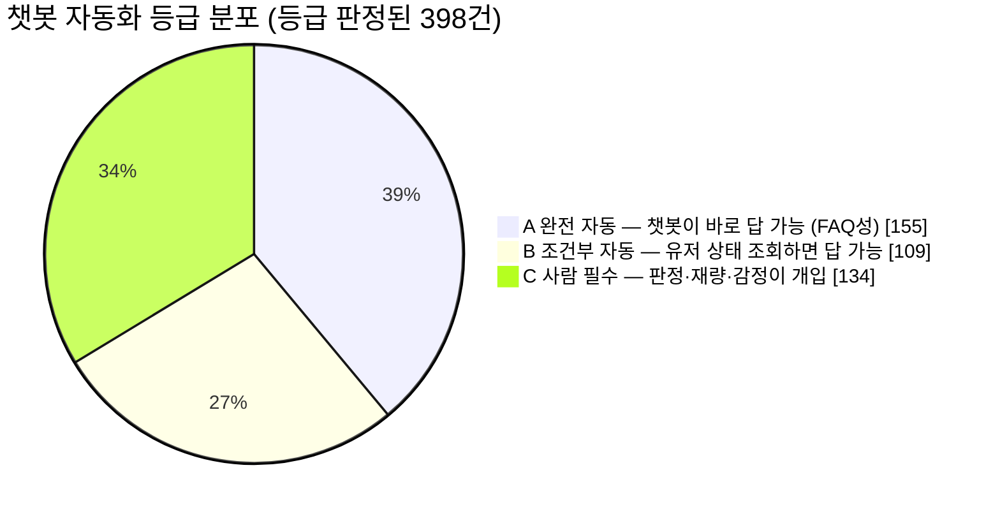
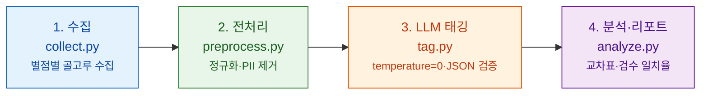

# SNOW·B612 앱 리뷰로 보는 CS 문의 유형 & 챗봇 자동화 가능성

> **한 문장으로.** 카메라·AI 앱 **SNOW·B612**의 구글플레이 리뷰 약 500건을 읽고, *"무슨 문의가 많은가"* 와 *"그중 챗봇이 대신 답할 수 있는 건 얼마나 되는가"* 를 숫자로 정리한 분석입니다.

*(VOC = Voice of Customer, 고객의 목소리. 여기서는 앱 스토어 리뷰를 CS 문의의 대용 데이터로 삼았습니다 — 회사 내부 문의 로그에 접근할 수 없기 때문입니다.)*

**왜 만들었나.** SNOW **"AI CS 기획/운영 인턴"** 지원용 포트폴리오입니다. 이 자리는 상담원이 아니라, **CS 문의를 챗봇으로 흡수하고 그 로그를 앱 개선 신호로 되돌리는** 프로덕트 역할입니다. 그래서 두 가지를 미리 증명합니다 — **① 문의를 어떻게 분류할지 체계를 설계하는 능력**, **② AI(챗봇) 답변 품질을 관리하는 능력**.

<sub>무료 앱 시절엔 결과물이 맘에 안 들면 유저가 앱을 지웠지만, 건당 결제·구독으로 바뀐 지금은 **환불을 요구**합니다. 문의량과 판정 난이도가 같이 올랐고, 이걸 사람 수로 감당하면 마진이 사라집니다 — 그래서 챗봇 자동화가 과제입니다.</sub>

---

## ⏱️ 30초 요약

| | |
|---|---|
| **무엇을 했나** | SNOW·B612 구글플레이 한국어 리뷰 495건을 **2가지 기준**(문의 유형 · 챗봇 자동화 등급)으로 분류·집계 |
| **가장 많은 문의** | **촬영·기능 사용 35.4%** (필터·카메라가 원하는 대로 안 됨), 뒤이어 결제·구독 22.4% |
| **챗봇이 답할 수 있는 비율** | **완전 자동 후보 38.8%** → 백엔드 조회까지 붙이면 **66.0%** *(가능성 추정치이지, 문의가 그만큼 준다는 뜻은 아님)* |
| **핵심 발견** | 문의 유형 분류는 **믿을 만하지만(정답 대비 82% 일치)**, 챗봇 등급 판정은 **아직 사람 검토가 필요(47.6%)** |
| **성격** | 6시간 MVP · 재현 가능한 데이터 파이프라인(수집→전처리→태깅→분석) |

<sub>표본 495건(판단 보류 5건 제외) · 기간 2021-11 ~ 2026-09 · 채널 구글플레이 한국어 · SNOW 250건 / B612 250건</sub>

---

## 📊 핵심 결과 3가지

### 1) 어떤 문의가 많은가

내용 있는 실질 문의 중 **촬영·기능 사용**이 압도적으로 많고 **결제·구독**이 뒤를 잇습니다. (전체의 19.2%는 별점만 남긴 칭찬·비난이라 집계에서 제외)

| 유형 | 건수 | 비율 | |
|---|---:|---:|---|
| 촬영·기능 사용 | 175 | **35.4%** | `████████████████████` |
| 결제·구독 | 111 | **22.4%** | `█████████████` |
| (분석 제외: 내용 없음) | 95 | 19.2% | `███████████` |
| 광고 | 44 | 8.9% | `█████` |
| 설치·계정 | 26 | 5.3% | `███` |
| 저장·공유 | 24 | 4.8% | `███` |
| AI 생성 | 18 | 3.6% | `██` |
| 정책·개인정보 | 2 | 0.4% | `▏` |

### 2) 챗봇이 얼마나 대신 답할 수 있나 — 이 프로젝트의 핵심 질문

문의를 챗봇이 답하기 쉬운 순서로 3등급(A/B/C)으로 나눴습니다.



**완전 자동(A) 38.8%**, 유저 상태 조회가 필요한 **조건부(B)까지 더하면 66.0%**입니다. (실질 문의 400건 기준)

> ⚠️ 이 비율은 *"자동화가 될 것 같은 비율"* 이지, 실제 문의가 그만큼 줄어든다는 뜻이 **아닙니다.** 내부 티켓 데이터 없이는 실제 감소율을 알 수 없습니다.

### 3) 유형 × 등급 교차표 — "어느 유형부터 챗봇으로 돌릴까"

같은 문의라도 챗봇 난이도는 A~C로 갈립니다. **정답이 고정된 A가 많이 몰린 유형일수록 챗봇 도입 효과가 큽니다.**

| 유형 | A 완전자동 | B 조건부 | C 사람필수 | 합계 |
|---|---:|---:|---:|---:|
| 촬영·기능 사용 | **79** | 23 | 72 | 174 |
| 결제·구독 | 18 | **64** | 29 | 111 |
| 광고 | 31 | 1 | 12 | 44 |
| 설치·계정 | 18 | 4 | 4 | 26 |
| 저장·공유 | 3 | 13 | 7 | 23 |
| AI 생성 | 5 | 4 | 9 | 18 |
| 정책·개인정보 | 1 | 0 | 1 | 2 |
| **합계** | **155** | **109** | **134** | **398** |

→ **챗봇 착수 1순위**: A 비중이 높은 **광고(70.5%)·설치/계정(69.2%)**, 그리고 건수가 가장 많은 **촬영·기능 사용(A 79건)**.

---

## ✅ 가장 중요한 발견 — 신뢰도를 숫자로 밝혔다

LLM이 매긴 태그를 그대로 믿지 않고, **무작위 50건을 정답 삼아 독립적으로 다시 분류**해 얼마나 맞는지 측정했습니다.

| 기준 | 정답과 일치율 | | 판정 |
|---|---:|---|---|
| **문의 유형** | 82.0% | `████████░░` | ✅ 믿을 만함 |
| **챗봇 자동화 등급** | 47.6% | `█████░░░░░` | ⚠️ 아직 사람 검토 필요 |

> **핵심:** 문의를 유형별로 나누는 건 자동화해도 되지만, **"이건 챗봇이 되네/안 되네" 판정은 아직 사람이 봐야 합니다.** 이것이 *"AI로 CS를 자동화하되, 그 한계까지 안다"* 는 이 프로젝트의 메시지입니다.
> (일치율은 우연히 맞을 확률을 걷어낸 통계로도 확인 — Cohen's κ 유형 0.765 / 등급 0.244. 불일치는 무작위가 아니라 *취향 불만 vs 품질 불량* 같은 **경계 유형**에 몰려, 분류 체계를 손봐야 할 지점을 알려줍니다.)

---

## 🧭 분류 체계 — 이 프로젝트의 지적 핵심

모든 숫자는 아래 **두 축 + 한 플래그**로 매겼습니다. 체계는 코드에 박지 않고 [`taxonomy.json`](taxonomy.json)에서 읽어옵니다.

**① 유형 (What) — "무엇에 대한 문의인가"**
설치·계정 / 촬영·기능 사용 / AI 생성 / 저장·공유 / 결제·구독 / 광고 / 정책·개인정보 (+ 내용 없음)

**② 챗봇 자동화 등급 (So what) — "챗봇이 얼마나 스스로 답하나"**

| 등급 | 뜻 |
|:---:|---|
| **A 완전 자동** | 정답이 고정. 유저가 누군지 몰라도 답 가능 (FAQ성) |
| **B 조건부 자동** | 유저 상태 조회(결제내역·계정)가 필요 |
| **C 사람 필수** | 판정·재량·감정이 개입 (예: 환불 여부, 취향 불만) |

**➕ 플래그 `product_issue`** — 챗봇으로 막을 게 아니라 **앱 자체를 고쳐야 하는** 이슈 표시. 이번 표본에서 **254건**(51.3%)이 여기 해당 → CS 로그를 앱 개선 신호로 되돌리는 지점.

> **왜 이렇게 설계했나 (요점):** ⓐ 유형(무엇)과 등급(그래서 챗봇이 되나)을 **별도 축으로 분리**해야 실행 가능한 결론이 나옵니다. ⓑ 앱이 아니라 **유저 행동 단계**(설치→촬영→저장→결제)로 나눠 표본이 조각나지 않게 했습니다. ⓒ 분류 체계는 정답이 아니라 **가설(v0)** 이고, 검수로 검증·수정되어 v1이 되는 것이 정상 — 그 재설계 루프 자체가 산출물입니다.

---

## ⚠️ 이 분석의 한계 (먼저 밝힘)

1. **리뷰는 CS 문의의 대용 지표다.** 환불처럼 고객센터로 직행하는 문의는 리뷰에 덜 남아 과소 추정될 수 있다.
2. **한국어·구글플레이·2개 앱에 편중**됐다. App Store와 해외 분포는 검증하지 못했다.
3. **A등급 비율은 자동화 가능성 추정치이지, 실제 문의 감소율이 아니다.**

---

## 📂 더 깊이 보려면

| 보고 싶은 것 | 파일 |
|---|---|
| **결과 전문**(앱 간 차이, 검수 상세) | [`docs/report.md`](docs/report.md) |
| **종합 브리핑**(설계 논리, JD 대비 역량, 방법론 방어) | [`PORTFOLIO.md`](PORTFOLIO.md) |
| **분류 체계 정의 · 설계 근거** | [`taxonomy.json`](taxonomy.json) · [`docs/USER_JOURNEY.md`](docs/USER_JOURNEY.md) · [`docs/ADR.md`](docs/ADR.md) |

---

<details>
<summary><b>🛠️ 부록 — 어떻게 만들었나 (파이프라인 · 실행 · 데이터 원칙)</b></summary>

<br>

웹앱이 아니라 **단계별 독립 스크립트**로, 파일(JSON/CSV)로 데이터를 넘깁니다. 한 스크립트는 한 단계만 담당합니다.



| 단계 | 스크립트 | 핵심 |
|---|---|---|
| 1. 수집 | [`src/collect.py`](src/collect.py) | 별점 층화 수집(1점 40%/2~3점 40%/4~5점 20%) |
| 2. 전처리 | [`src/preprocess.py`](src/preprocess.py) | 정규화, 중복·빈 리뷰 제거, **PII(작성자명) 드롭** |
| 3. 태깅 | [`src/tag.py`](src/tag.py) | taxonomy 기준 배치 태깅, `temperature=0`, JSON 강제 파싱 + 범위 검증 |
| 4. 분석 | [`src/analyze.py`](src/analyze.py) | 유형×등급 교차표, 앱별 차이, 자동화 비율, 검수 일치율 |

**기술 스택:** Python 3.11 · pandas · google-play-scraper · Anthropic Claude(temperature=0) · openpyxl/Markdown

**실행 방법**
```bash
python -m venv .venv && source .venv/bin/activate
pip install -r requirements.txt
cp .env.example .env        # ANTHROPIC_API_KEY 입력
python src/collect.py       # 1. 수집   → data/raw/
python src/preprocess.py    # 2. 전처리 → data/processed/sample.csv
python src/tag.py           # 3. 태깅   → data/processed/tagged.csv
python src/analyze.py       # 4. 분석   → docs/report.md (+ report.xlsx)
```

**데이터·보안·윤리 원칙** — 공개 리포지토리라 유출은 되돌릴 수 없다는 전제에서: ① 비밀키·원본 데이터를 커밋하지 않음(`.env`·`data/`는 `.gitignore`), ② **리뷰 원문을 재배포하지 않음**(집계·분류 명칭만 공개), ③ 작성자명 등 PII는 전처리에서 드롭.

</details>
